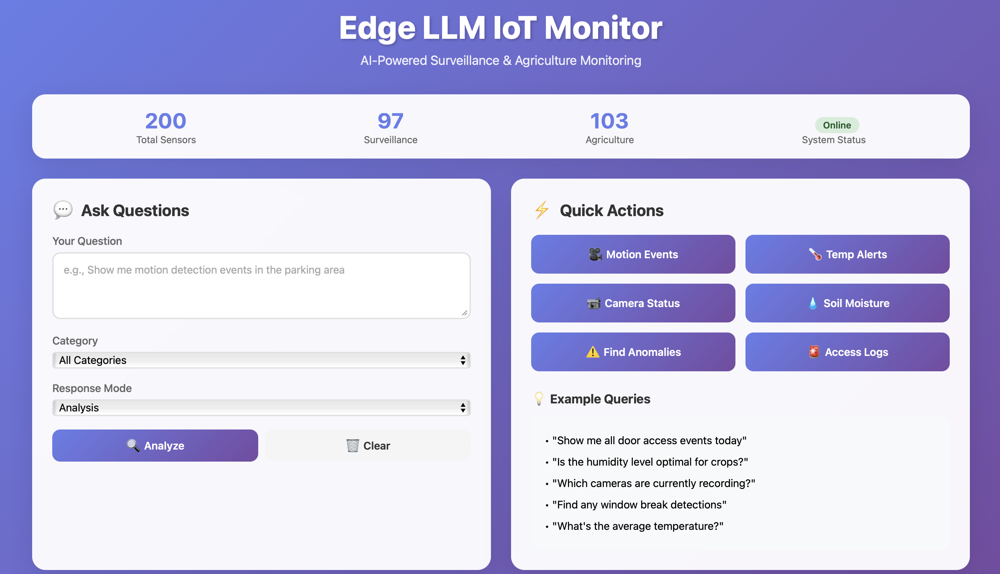

# 🚀 Edge LLM IoT Monitor

[](https://www.python.org/downloads/)
[](https://fastapi.tiangolo.com/)
[](LICENSE)

AI-powered IoT monitoring system with Edge Computing, RAG (Retrieval-Augmented Generation), and LLM capabilities. Built for real-time surveillance and agriculture sensor analysis - optimized for edge deployment on M1/M2 Macs.

---

## 📸 Screenshots

### Dashboard Overview

*Modern, responsive dashboard with real-time statistics and natural language querying*

### Query Analysis in Action

*AI-powered analysis of IoT sensor data with context-aware responses*

---

## 🎯 Features

- **🔥 Edge-Optimized LLM**: Qwen 2.5 1.5B running on M1/M2/M3 with MPS acceleration
- **🧠 RAG System**: ChromaDB-based retrieval for intelligent sensor data querying
- **🎨 Beautiful UI**: Modern, gradient-based dashboard with real-time updates
- **🏭 Multi-Domain Support**: 
  - **Surveillance**: Motion detection, camera monitoring, access control
  - **Agriculture**: Soil moisture, temperature, humidity, light sensors
- **⚡ Real-time Analysis**: Anomaly detection, alerts, and intelligent summaries
- **📊 Performance Optimized**: 12-19 tokens/sec on M1, ~3GB model, <100ms retrieval
- **🔌 REST API**: FastAPI backend with comprehensive endpoints

---

## 🏗️ Architecture
```
┌─────────────┐
│   User UI   │ ← Beautiful Web Dashboard
└──────┬──────┘
       │
       ▼
┌─────────────────────────────────────────────┐
│           FastAPI REST API                  │
│  ┌─────────────────────────────────────┐   │
│  │   RAG-LLM Pipeline                  │   │
│  │                                     │   │
│  │  ┌──────────┐      ┌────────────┐  │   │
│  │  │   RAG    │◄────►│    LLM     │  │   │
│  │  │ System   │      │  Handler   │  │   │
│  │  └────┬─────┘      └─────┬──────┘  │   │
│  │       │                  │          │   │
│  │       ▼                  ▼          │   │
│  │  ┌──────────┐      ┌────────────┐  │   │
│  │  │ChromaDB  │      │Qwen 2.5 1.5B│ │   │
│  │  │(Vectors) │      │   (MPS)    │  │   │
│  │  └──────────┘      └────────────┘  │   │
│  └─────────────────────────────────────┘   │
└─────────────────────────────────────────────┘
              ▲
              │
    ┌─────────┴─────────┐
    │   IoT Sensors     │
    │ (Surveillance &   │
    │   Agriculture)    │
    └───────────────────┘
```

**Data Flow:**
1. User submits natural language query via UI
2. RAG system retrieves relevant sensor documents from ChromaDB
3. Context + Query sent to Qwen LLM
4. LLM generates intelligent, context-aware response
5. Response displayed with metadata (speed, relevance, etc.)

---

## 📊 Performance Metrics

### On Apple M1 Mac:
| Metric | Value |
|--------|-------|
| Model Load Time | 5-8 seconds |
| Inference Speed | 12-19 tokens/second |
| Model Size (FP16) | ~3GB |
| RAG Retrieval | <100ms |
| End-to-End Query | 10-15 seconds |

### Resource Usage:
- **RAM**: ~4-5GB during inference
- **GPU**: Full MPS utilization on M1
- **Disk**: ~3.5GB (model + embeddings + vector DB)

---

## 🛠️ Tech Stack

| Component | Technology |
|-----------|-----------|
| **LLM** | Qwen2.5-1.5B-Instruct |
| **Embeddings** | sentence-transformers/all-MiniLM-L6-v2 |
| **Vector DB** | ChromaDB (persistent) |
| **API Framework** | FastAPI + Uvicorn |
| **ML Libraries** | PyTorch, Transformers, LangChain |
| **Frontend** | Vanilla JS with modern CSS |

---

## 📦 Installation

### Prerequisites
- Python 3.9+
- Mac with M1/M2/M3 chip (or CUDA GPU for other systems)
- 8GB+ RAM
- 5GB free disk space

### Quick Setup
```bash
# Clone repository
git clone https://github.com/chikamichka/edge-llm-iot-monitor.git
cd edge-llm-iot-monitor

# Create virtual environment
python3 -m venv venv
source venv/bin/activate  # On Windows: venv\Scripts\activate

# Install dependencies
pip install -r requirements.txt

# Generate sample IoT data
python -m data.sensor_generator

# Initialize RAG system (downloads embeddings + ingests data)
python -m rag.rag_system
```

---

## 🚀 Quick Start

### Start the Server
```bash
python -m api.main
```

Server starts at `http://localhost:8000`

### Access the Dashboard

Open your browser: **http://localhost:8000**

You'll see:
- 📊 Real-time sensor statistics
- 💬 Natural language query interface
- ⚡ Quick action buttons for common queries
- 📈 Performance metrics

---

## 📡 API Endpoints

### `POST /query`
Query sensor data with natural language

**Request:**
```json
{
  "query": "Show me temperature alerts in agriculture sensors",
  "category": "agriculture",
  "mode": "alert",
  "n_results": 5,
  "max_tokens": 200
}
```

**Response:**
```json
{
  "query": "Show me temperature alerts...",
  "mode": "alert",
  "response": "Analysis: There are 3 temperature alerts...",
  "retrieved_documents": 5,
  "metadata": {
    "inference_time": 12.5,
    "tokens_generated": 150,
    "tokens_per_second": 12.0
  }
}
```

### `GET /stats`
Get RAG system statistics

**Response:**
```json
{
  "total_documents": 200,
  "surveillance": 97,
  "agriculture": 103
}
```

### `GET /health`
Health check

**Response:**
```json
{
  "status": "healthy",
  "rag_initialized": true,
  "llm_loaded": true
}
```

### Other Endpoints
- `POST /analyze-anomalies` - Detect anomalies
- `POST /summary` - Get activity summary
- `POST /ingest` - Ingest new sensor data

---

## 🧪 Testing

### Test Individual Components
```bash
# Test GPU/MPS support
python test_gpu.py

# Test LLM inference
python test_llm.py

# Test RAG system
python -m rag.rag_system

# Test complete pipeline
python -m rag.rag_llm_pipeline
```

### Example Test Output
```
✓ Model loaded in 6.10s
✓ Model size: 2944.40 MB
✓ Retrieved 3 documents
✓ Generated in 12.84s
📊 Speed: 15.57 tok/s
```

---

## 📂 Project Structure
```
edge-llm-iot-monitor/
├── api/
│   ├── main.py              # FastAPI server
│   └── static/
│       └── index.html       # Dashboard UI
├── models/
│   ├── config.py            # Configuration management
│   └── llm_handler.py       # LLM inference engine
├── rag/
│   ├── rag_system.py        # ChromaDB RAG implementation
│   └── rag_llm_pipeline.py  # RAG + LLM integration
├── data/
│   ├── sensor_generator.py  # Mock IoT data generator
│   └── sensor_data.json     # Generated sensor data
├── docs/
│   └── images/              # Screenshots
├── chroma_db/               # Vector database (generated)
├── test_llm.py              # LLM testing
├── test_gpu.py              # GPU/MPS testing
├── requirements.txt         # Dependencies
├── .env                     # Configuration
├── .gitignore
└── README.md
```

---

## 💡 Example Queries

### Surveillance Queries
```
"Show me all motion detection events in the parking area"
"Are there any unauthorized access attempts?"
"Which cameras are currently recording?"
"Find any window break detections"
"What's the status of door sensors?"
```

### Agriculture Queries
```
"Find temperature alerts in the greenhouse"
"Is soil moisture optimal for crops?"
"Show me humidity levels over 70%"
"What's the light exposure in zone B?"
"Summarize last 24 hours of sensor readings"
```

### System Queries
```
"Detect any anomalies in the system"
"Show me all critical alerts"
"What devices need attention?"
"Give me an overall system status"
```

---

## 🎓 Use Cases

### 🏢 Smart Building Surveillance
- **Motion Detection**: Real-time alerts for unauthorized movement
- **Access Control**: Track door/window access with user IDs
- **Camera Monitoring**: Status checks, recording verification
- **Security Analytics**: Pattern detection, anomaly identification

### 🌾 Precision Agriculture
- **Environmental Monitoring**: Temperature, humidity, light tracking
- **Soil Management**: Moisture levels, irrigation needs
- **Alert System**: Threshold-based notifications
- **Predictive Insights**: Trend analysis, recommendations

---

## 🔧 Configuration

Edit `.env` file:
```bash
# Model Configuration
MODEL_NAME=Qwen/Qwen2.5-1.5B-Instruct
DEVICE=mps  # or 'cuda' or 'cpu'
MAX_LENGTH=512

# RAG Configuration
EMBEDDING_MODEL=sentence-transformers/all-MiniLM-L6-v2
CHROMA_PERSIST_DIR=./chroma_db
COLLECTION_NAME=iot_sensors

# API Configuration
API_HOST=0.0.0.0
API_PORT=8000
```

---

## 🚀 Deployment Options

### 1. Edge Devices (Raspberry Pi / Jetson Nano)
```bash
# Use quantized models for better performance
MODEL_NAME=Qwen/Qwen2.5-1.5B-Instruct-GGUF
MAX_LENGTH=256
```

### 2. Cloud Deployment
```bash
# Use Docker
docker build -t edge-llm-iot .
docker run -p 8000:8000 edge-llm-iot
```

### 3. Production Best Practices
- ✅ Add authentication (JWT tokens)
- ✅ Implement rate limiting
- ✅ Set up logging and monitoring
- ✅ Use HTTPS with SSL certificates
- ✅ Add request validation
- ✅ Implement caching layer

---

## 📈 MLOps Features

This project demonstrates production-ready MLOps practices:

- ✅ **Model Management**: Easy model swapping via config
- ✅ **Monitoring**: Performance metrics, inference time tracking
- ✅ **API-First**: RESTful design, proper error handling
- ✅ **Modularity**: Separated concerns (LLM, RAG, API)
- ✅ **Testing**: Component and integration tests
- ✅ **Documentation**: Comprehensive README, code comments
- ✅ **Configuration**: Environment-based settings
- ✅ **Scalability**: Async API, batch processing ready

---

## 🎯 Skills Demonstrated

### LLM Engineering
- Model optimization (FP16, quantization)
- Device mapping (MPS, CUDA, CPU)
- Prompt engineering for domain tasks
- Context window management

### RAG Implementation
- Vector embeddings generation
- Semantic search with ChromaDB
- Context retrieval and ranking
- Knowledge grounding

### MLOps
- API design and deployment
- Model monitoring and metrics
- Configuration management
- Error handling and logging

### Edge Computing
- Resource optimization
- Latency reduction
- On-device inference
- Performance benchmarking

---

## 🔮 Future Enhancements

- [ ] LoRA fine-tuning on domain-specific terminology
- [ ] Model quantization (INT8, INT4) for faster inference
- [ ] Streaming responses with WebSockets
- [ ] Multi-agent system for complex queries
- [ ] Time-series analysis and forecasting
- [ ] Real IoT device integration (MQTT, REST)
- [ ] Docker containerization
- [ ] CI/CD pipeline with GitHub Actions
- [ ] Grafana dashboard for monitoring
- [ ] Model A/B testing framework

---

## 🤝 Contributing

Contributions are welcome! Please feel free to submit a Pull Request.

---

## 📄 License

MIT License - see [LICENSE](LICENSE) file for details

---

## 🙏 Acknowledgments

- **Qwen Team** for the excellent small language model
- **Hugging Face** for transformers library
- **ChromaDB** for the vector database
- **FastAPI** for the amazing web framework

---

## 📬 Contact

**Your Name** - [Your Email] - [LinkedIn Profile]

Project Link: [https://github.com/chikamichka/edge-llm-iot-monitor](https://github.com/chikamichka/edge-llm-iot-monitor)

---

<div align="center">

**Built with ❤️ for Edge AI and IoT**

⭐ Star this repo if you find it helpful!

</div>
